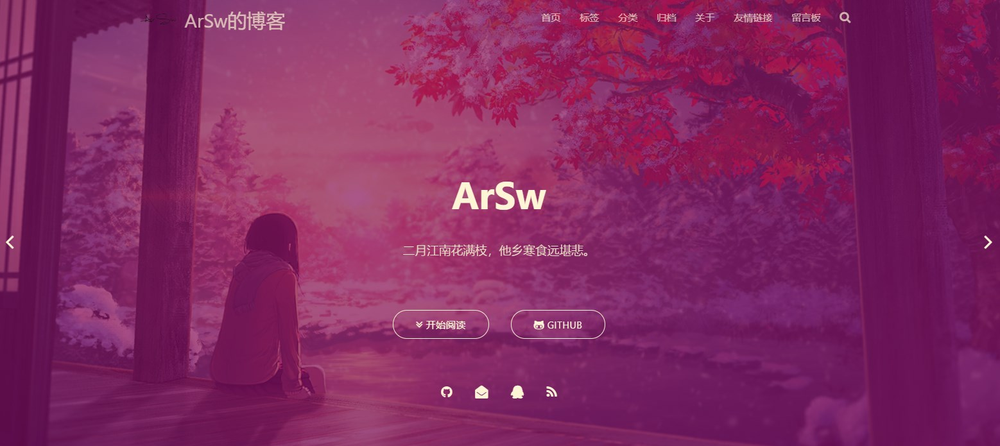

# 博客

- [地址](https://www.yangting.online/)

# 博客搭建讲解
- [地址](https://www.yangting.online/2019/09/25/blog/)

主要步骤：
1. 安装Node.js
2. 安装Hexo
3. 安装Git和创建GitHub仓储
4. 本地连接GitHub
5. 部署到Netlify

# 主题
我使用的是`hexo-theme-matery`作为博客的主题
- [GitHub地址](https://github.com/blinkfox/hexo-theme-matery)
- [效果图](https://blinkfox.github.io/)

